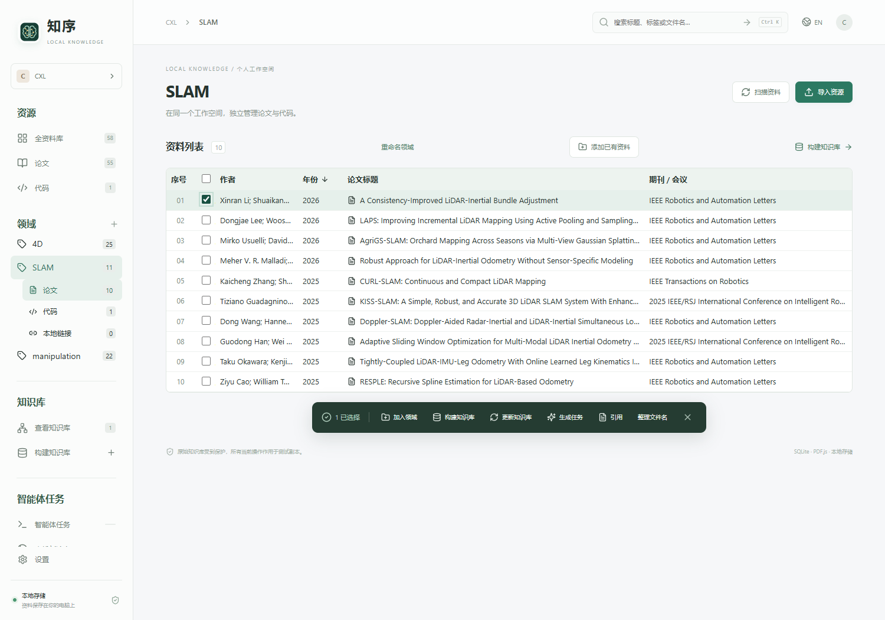
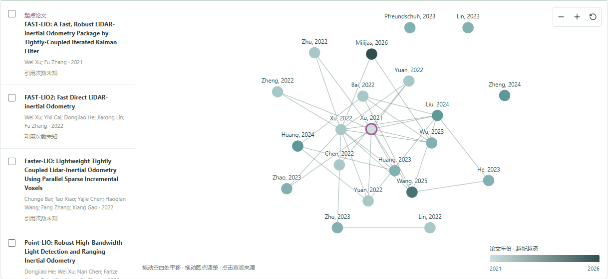
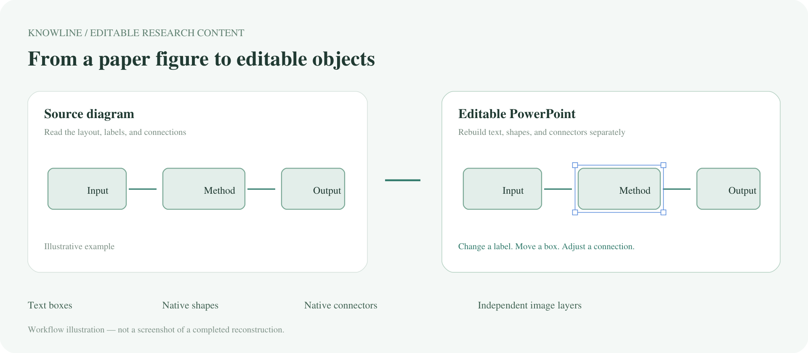
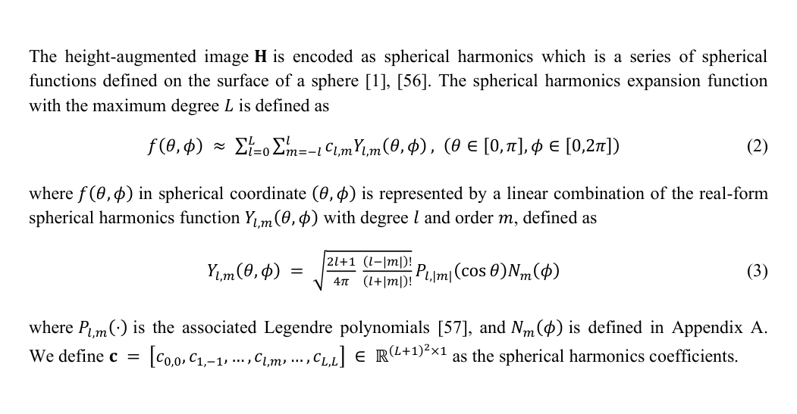
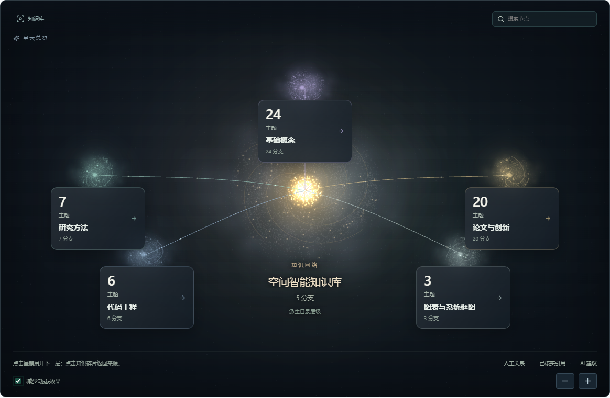
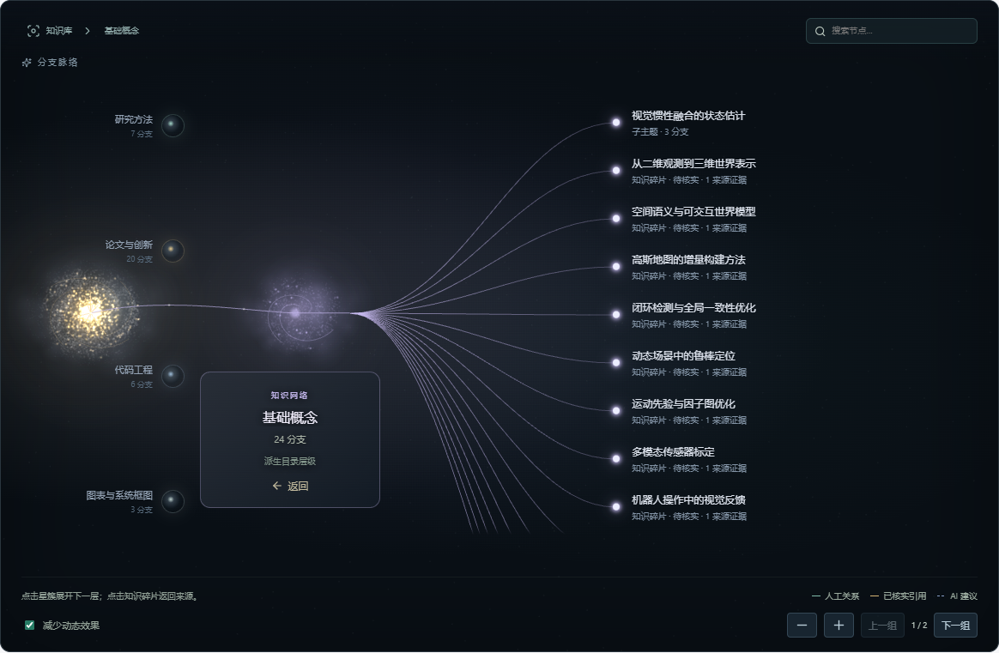
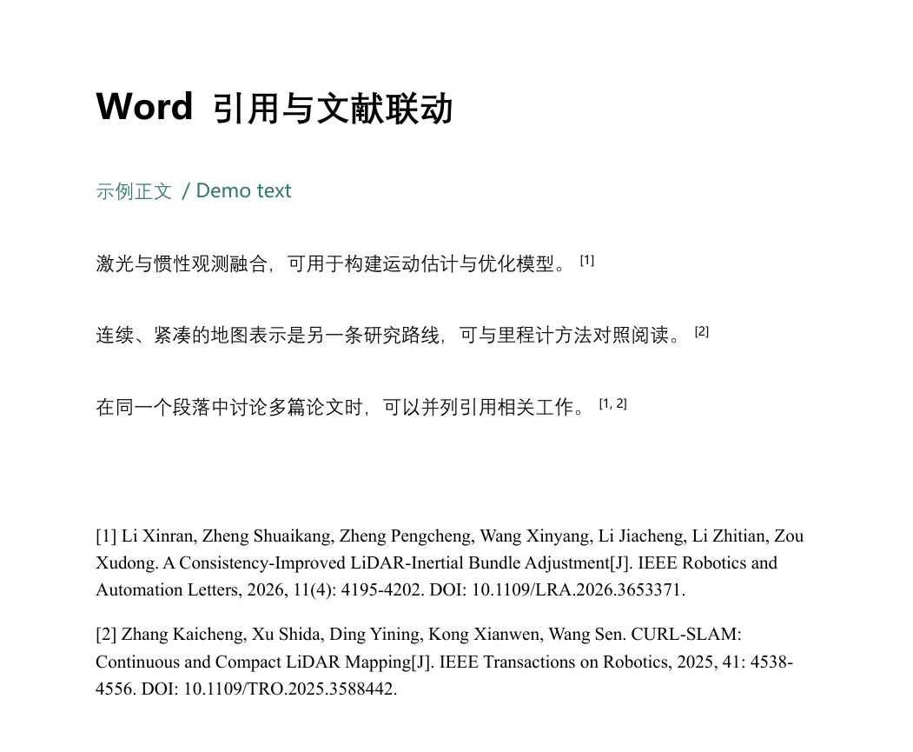

# KnowLine · 知序

### Next-Generation Research Knowledge Management Platform

**Turn research materials into knowledge, and connect knowledge to research.**

**Multiple Resource Types · Knowledge Base Construction & Visualization · Seamless AI Collaboration**

[简体中文](README.md) · [English](README_EN.md)

## About KnowLine

**KnowLine** brings papers, code, figures, equations, and reading notes into one research workspace. Research domains, knowledge bases, and AI collaboration connect literature discovery, reading, knowledge organization, and academic writing, helping researchers build a reusable body of knowledge over time.

Start with a paper, discover related work, explore the research landscape, extract editable figures and equations, and bring those materials into writing and Word citations. Each step builds on the same collection of research resources.

> This repository currently presents the platform and its feature examples. It contains bilingual documentation and showcase images only; platform source code and installation packages are not provided at this stage.

## Import and Manage Multiple Resource Types

- **Papers and literature:** import PDFs, organize titles, authors, years, and publication venues, and keep annotations and reading notes.
- **Code resources:** manage code directories and ZIP archives alongside the papers they support.
- **Figures, equations, and notes:** extract and organize research content while retaining its original sources.
- **Research domains and knowledge bases:** organize materials by topic and reuse a resource across different research questions and knowledge bases.

## Four Core Capabilities

### 01 · Literature Discovery, Research Mapping, and Import

Start from a research topic or a representative paper. Work with AI to discover relevant studies, verify bibliographic metadata, and explore the research landscape through interactive paper relationship maps. Selected candidates can then be verified, available full texts obtained, and the papers imported into a chosen research domain.

- Describe search goals using topics, keywords, and publication years.
- Explore related papers, research developments, and evidence through interactive maps.
- Select candidates and add the materials you need to your research domain.
- Keep verified citation relationships distinct from semantic relevance, with source evidence retained.

**Example request:** “Start with FAST-LIO, find related LiDAR–inertial odometry research, build a literature map, and import the papers I select.”

*Actual paper relationship map: explore nodes, publication years, and connections, then select papers for import.*

### 02 · Paper Figure Reconstruction and Editable Equation Copying

Turn technical diagrams and mathematical expressions from papers into Office content that can be edited, formatted, and reused, reducing repetitive drawing and manual equation entry.

- **Figure reconstruction:** rebuild boxes, text, arrows, and other diagram elements as editable PowerPoint objects while preserving their structure and connections.
- **Equation copying:** recognize equations and surrounding text in a selected region and convert them into native editable Office equations and text through the corresponding Word or PowerPoint workflow.
- **Further editing:** adjust text, symbols, shapes, and layout for papers, presentations, and research discussions.

**Example request:** “Reconstruct this method diagram as an editable PowerPoint slide, and copy the selected text and equations into Word while keeping the equations editable.”

*Workflow illustration: text, shapes, and connectors are rebuilt as separate editable objects. This diagram explains the process.*

*Preview of an actual conversion result: selected text and equations from CURL-SLAM converted into native editable Word content.*

### 03 · Knowledge Base Construction and Visualization

Select resources around a research question and organize concepts, methods, paper contributions, code, and figures into a growing research knowledge base.

- Define the resource scope and organization goals of each knowledge base.
- Organize reading results into knowledge cards linked to their sources.
- Explore topic hierarchies, knowledge branches, and resource connections through visual networks.
- Search, expand, and drill down from a broad topic to a specific paper page or code location.

**Example request:** “Build a spatial intelligence knowledge base from these papers and code resources, organize it into concepts, methods, paper contributions, and code engineering, and visualize the knowledge network.”

*Actual interface examples: move from the topic overview into individual branches and their supporting sources.*

### 04 · Automatic Paper Citations and Word Integration

Connect verified references in your resource library to the Word writing workflow. Select papers relevant to a paragraph, insert dynamic citations, and maintain the references at the end of the document.

- Insert **superscript numeric citations** at sentence endings and reuse the same number when a paper is cited again.
- Display references as **ordinary paragraphs**, with links from in-text numbers to reference entries and back.
- While connected to a KnowLine collaboration session, deleting or moving in-text citations updates the reference list and numbering; deleting a complete reference entry also removes its corresponding in-text citations.
- Switch citation styles and adjust reference fonts and sizes consistently.
- Work in a separate Word copy while preserving the original document.

**Example request:** “Cite relevant papers from this research domain in the related-work paragraph, use superscript numbers, generate the references at the end, and retain links in both directions.”

*Actual output from a dedicated demonstration document: superscript numbers correspond to full reference entries in ordinary paragraphs. Follow the links in Word using Ctrl + click according to your Word settings.*

## Seamless AI Collaboration

Select resources in KnowLine and describe your goal in natural language: discover, analyze, compare, organize, reconstruct, or cite. The current AI session works with the selected materials and context, then returns its results to the same workspace for further reading, knowledge building, and writing.

**One workspace, one continuous research journey:**

**Import resources → Map the literature → Read and analyze → Reuse figures and equations → Visualize knowledge → Write and cite in Word**

The current collaboration workflow works with Codex. Full-text availability, editable figure reconstruction, and Office integration depend on the available sources, the selected task scope, and the local Office environment.

---

**KnowLine — Let research knowledge grow with structure.**
